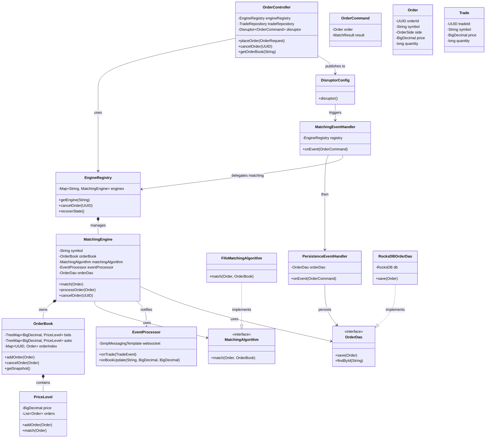

# Distributed Order Matching Engine - UML Class Diagram

## Diagram Overview
- **Controller Layer**: Handles HTTP requests and dispatches orders to the LMAX Disruptor ring buffer.
- **Engine Layer**: `MatchingEngine` is the core, managing the `OrderBook`. It supports multiple symbols via `EngineRegistry`.
- **Infrastructure**:
    - **Disruptor**: Asynchronous event processing pipeline (`MatchingEventHandler` -> `PersistenceEventHandler`).
    - **Persistence**: Hybrid approach using **RocksDB** (Fast Key-Value for active orders) and **PostgreSQL** (Trades).
